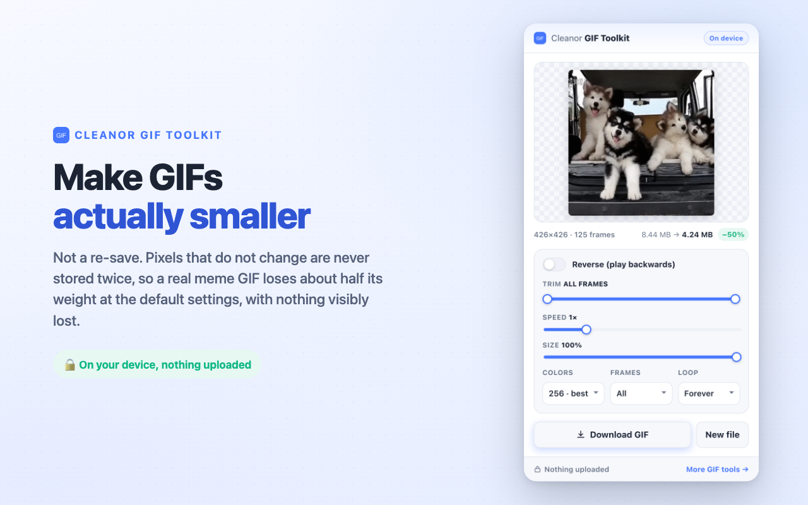
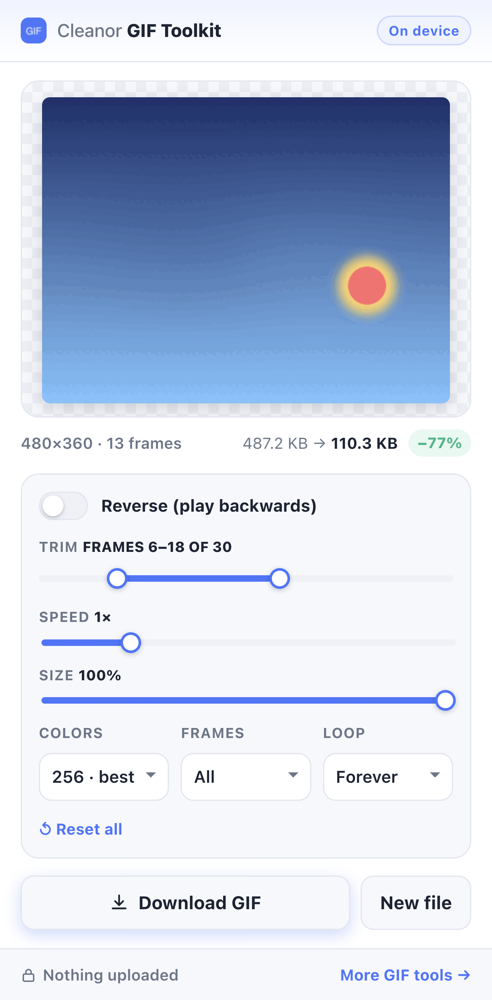
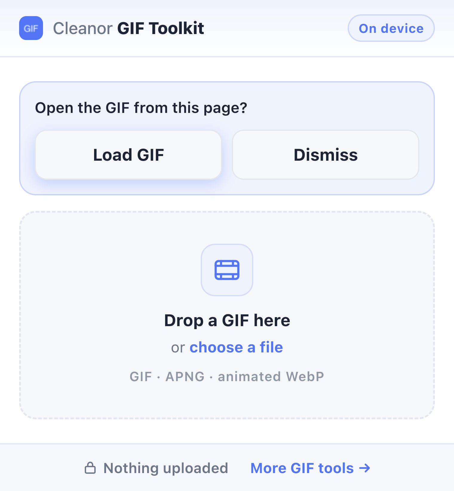

<div align="center">


# GIF Compressor & GIF Editor for Chrome

**Free Chrome extension to compress a GIF, reduce GIF file size, reverse, trim, speed up and resize animated GIFs. On your device, nothing is uploaded.**

[](https://chromewebstore.google.com/detail/gif-toolkit-reverse-optim/fdfeajbfkhepkdppeiccbjghgkpbpobl)
[](LICENSE)
[](manifest.json)
[](#privacy--permissions)
[](https://cleanor.app/tools/reverse-gif)
[](https://youtu.be/OHB6zxRGRaw)



</div>

---

## Install

**[Install from the Chrome Web Store](https://chromewebstore.google.com/detail/gif-toolkit-reverse-optim/fdfeajbfkhepkdppeiccbjghgkpbpobl)** (free, no account).

**From source (developer mode):**

```bash
git clone https://github.com/cleanor-app/gif-compressor-chrome-extension.git
# chrome://extensions → enable "Developer mode" → "Load unpacked" → pick the folder
```

### Quick start

1. Open it from the toolbar, or press <kbd>Alt</kbd>+<kbd>Shift</kbd>+<kbd>G</kbd>. Or right-click any GIF on a web page and choose **"Open this GIF in Cleanor GIF Toolkit"**.
2. Drop in a **GIF**, an **APNG** or an **animated WebP**.
3. It is already compressed at the default settings. Turn the dials if you need it smaller, and watch the exact output size update live.
4. Press **Download GIF**.

Nothing is uploaded, there is no account, and there is no tracking. The extension has no server to send your file to.

---

## What it does

| | |
| --- | --- |
| 🗜️ **[Compress a GIF / reduce GIF file size](#compress-a-gif-and-reduce-gif-file-size)** | Real inter-frame delta encoding, not a re-save that makes the file *bigger*. |
| 🔄 **[Reverse a GIF](#reverse-a-gif)** | Play any animation backwards with one switch. |
| ✂️ **[Trim a GIF](#trim-a-gif)** | Drag a two-handle range and keep only the frames you want. |
| ⏩ **[Change GIF speed](#change-gif-speed)** | Retime from 0.25× to 4×. |
| 📐 **[Resize a GIF](#resize-a-gif)** | Scale to 20-100% of the original dimensions. |
| 🎨 **[Palette, frame rate, loop](#palette-frame-rate-and-loop)** | 256 → 32 colors, keep every 2nd/3rd frame, loop forever / once / 3×. |
| 🖱️ **[Right-click a GIF on any page](#right-click-a-gif-on-any-page)** | Edit it without saving the file first. |
| 🔀 **[APNG → GIF, animated WebP → GIF](#convert-apng-and-animated-webp-to-gif)** | Frame for frame, transparency intact. |

---

## Why another GIF compressor?

Most browser-based "GIF compressors" decode your animation and write every frame back out in
full. A GIF written that way is often **larger than the one you started with**, because the
original was already frame-optimized and your "optimizer" threw that optimization away.

Cleanor writes real **inter-frame deltas**: a pixel that is already the right colour on screen
is not stored again. It is written as the transparent index with GIF disposal method 1 ("leave
the previous pixels in place"), and long runs of that one index are exactly what LZW squeezes.

Two details make that work on GIFs people actually have, rather than only on synthetic ones:

- **One palette for the whole animation.** Written once as the global colour table, so indices
  are comparable across frames (and no frame pays for a local table).
- **A perceptual tolerance, not bit-equality.** Real GIFs are video-derived: dither and
  compression noise nudge *every* pixel by a step or two on every frame, so "identical to the
  previous frame" almost never happens literally. A pixel counts as unchanged when it is within
  a small distance (12/255 per channel, [tuned by measurement](#measured-results)) of what is
  already on the canvas. Drift is bounded, because each pixel is compared against what is
  actually displayed, not against an ideal.

Bit-exact comparison alone would find nothing to skip on a real meme GIF, and the output would
come out **62% bigger** than the source. That is not a hypothetical: it is what this encoder did
before the tolerance was added.

### Measured results

Real numbers, produced by running the actual extension in Chrome 150 over real files, including
two ordinary meme GIFs downloaded from Giphy. Not estimates:

| Source GIF | Size | Default | 64 colors | ½ frames | 64 colors + ½ frames + 60% size |
| --- | --- | --- | --- | --- | --- |
| Real meme GIF *(dog reaction, 480×406, 28 frames)* | 1 233 KB | **966 KB** (−22%) | **847 KB** (−31%) | **619 KB** (−50%) | **190 KB** (−85%) |
| Real meme GIF *(husky puppies, 426×426, 125 frames)* | 8 641 KB | **4 345 KB** (−50%) | **4 123 KB** (−52%) | **2 634 KB** (−70%) | **723 KB** (−92%) |
| Moving subject, steady background | 487 KB | **128 KB** (−74%) | **97 KB** (−80%) | **73 KB** (−85%) | **28 KB** (−94%) |
| Simple animation, flat background | 177 KB | **29 KB** (−84%) | **27 KB** (−85%) | **19 KB** (−89%) | **9 KB** (−95%) |
| Transparent background *(alpha preserved)* | 81 KB | **46 KB** (−44%) | **44 KB** (−46%) | **23 KB** (−71%) | **11 KB** (−86%) |

At the default settings nothing about the animation changes: same dimensions, same frame count,
same palette size, same timing. Mean pixel error against the source is **~3/255 (about 1%)**,
which is why the default tolerance is 12 and not 20: at 20 the files are roughly half the size
again, but posterized patches start to show in flat areas, and shipping visible artefacts by
default is not a trade worth making.

The amount you save still depends on the GIF. A busy, full-motion clip has less repetition to
exploit than a subject moving over a background that stays put. When there is little to gain,
the popup says so and points at the controls that help, instead of showing a disappointing
number and leaving you to guess.

---

## Features in detail

### Compress a GIF and reduce GIF file size

Drop the file in and it is already compressed at the default settings, with the animation itself
untouched. Three dials take it further, and the exact output size updates as you turn them:

- **Size**: scale down. Fewer pixels is always the bluntest, most effective saving.
- **Frames**: keep all, every 2nd, or every 3rd. **The dropped frames' delays are merged into
  the frames that remain**, so a lighter GIF still plays at the speed you expect instead of
  quietly running fast. (Plenty of tools get this wrong.)
- **Colors**: 256 (best) → 128 → 64 (small) → 32 (tiny). One palette is built for the whole
  animation, so a smaller palette shrinks every frame at once.

Full walkthrough: **[How do I reduce GIF file size?](docs/reduce-gif-file-size.md)** ·
**[How do I compress a GIF for Discord?](docs/compress-a-gif-for-discord.md)**

### Reverse a GIF

Flip the switch and the animation plays backwards. Useful for turning a clip into a loop that
runs forward and back, undoing a direction that reads wrong, or landing a joke on the return
stroke. Frame timings are carried with their frames, so a reversed GIF keeps its rhythm.

Full walkthrough: **[How do I reverse a GIF?](docs/reverse-a-gif.md)**

### Trim a GIF



Drag the two handles to keep a range of frames. Cut the dead air before the action starts, stop
before the watermark at the end, or pull a single reaction out of a long clip. The handles
cannot cross, the frame count and file size update live, and the range is frame-exact: trimming
34-92 of 125 gives you exactly 59 frames.

Need to *split* a GIF into several files, or crop it to a region? Those live on the web version:
**[trim & split](https://cleanor.app/tools/trim-split-gif)** ·
**[crop](https://cleanor.app/tools/gif-cropper)**.

<br clear="right">

### Change GIF speed

0.25× to 4×, applied by retiming every frame delay (with the 20 ms floor that browsers enforce
on GIF playback). At 2× an 80 ms frame becomes 40 ms; at 0.5× it becomes 160 ms.

### Resize a GIF

Scale to anywhere from 20% to 100% of the source dimensions, with high-quality smoothing.

### Palette, frame rate and loop

Cap the palette, thin the frames, and set the loop count: forever, once, or three times. The
loop count is written into the GIF itself (the NETSCAPE application extension), not faked by the
player, and a source GIF's own loop setting is detected and preselected.

### Right-click a GIF on any page



Right-click a GIF you see anywhere on the web and choose **"Open this GIF in Cleanor GIF
Toolkit"**. It opens in a tab, asks you to confirm, and loads the image, with no saving the file
to disk first.

Access to that one website is requested **at that moment, for that origin only**. The extension
holds no host permissions up front, and it never touches a page's `<video>` element or media
streams, only an image you explicitly point at.

<br clear="right">

### Convert APNG and animated WebP to GIF

Drop an **APNG** or an **animated WebP** (or even a still PNG/JPEG) and it comes out as a GIF,
frame for frame. **Transparency survives**: alpha-carrying animations are written with a real
transparent index and disposal method 2, instead of coming back with black boxes where the
transparency used to be, a failure mode you will recognise from a lot of online converters.

More on the trade-off: **[GIF vs animated WebP](docs/gif-vs-animated-webp.md)**

---

## Docs

| Guide | What it answers |
| --- | --- |
| **[How do I reduce GIF file size?](docs/reduce-gif-file-size.md)** | The three things that make a GIF big, and the order to cut them in. |
| **[How do I compress a GIF for Discord?](docs/compress-a-gif-for-discord.md)** | Hitting a target file size, with a worked example (8.6 MB → 723 KB). |
| **[How do I reverse a GIF?](docs/reverse-a-gif.md)** | Playing an animation backwards without wrecking its timing. |
| **[GIF vs animated WebP](docs/gif-vs-animated-webp.md)** | Which format to use, and how to convert WebP or APNG to GIF. |

---

## How it works

No ffmpeg.wasm, no 25 MB WebAssembly payload, no remote code. The packaged extension is about
**36 KB zipped**, icons included.

1. **Decode**: the browser's native [`ImageDecoder`](https://developer.mozilla.org/en-US/docs/Web/API/ImageDecoder)
   API pulls out every frame (Chrome decodes animated GIF, APNG and animated WebP natively).
2. **Transform**: trim → reverse → thin → retime → resize, as plain operations on an array of
   `{ rgba, delayMs }` frames.
3. **Encode**: [gifenc](https://github.com/mattdesl/gifenc) (a small, dependency-free JS
   encoder) writes the GIF: one global palette, inter-frame deltas with a perceptual tolerance,
   and a real transparent index for alpha sources. See [why](#why-another-gif-compressor).

All of it happens in a **Web Worker**, so dragging a slider never freezes the popup, and only
the newest render is ever shown (stale results from an abandoned drag are discarded).

```
popup.html · popup.css · app.js   UI only: controls, live preview, download
worker.js                         decode / transform / encode, off the main thread
gif-core.js                       the pipeline; the only file that touches gifenc
background.js                     right-click menu, install & uninstall hooks
vendor/gifenc/                    the bundled encoder (9 KB)
```

### Verification

The extension is driven end-to-end in a real Chrome over CDP: **58 behavioural checks** covering
every control, and asserting on the *decoded output pixels*, not just the UI: that reverse
really reverses (frame 0 of the output matches the last frame of the source), that trimming is
frame-exact, that frame delays are retimed, that Download lands a valid `GIF89a` on disk, that a
corrupt file produces a clean error, and that transparency survives the round-trip.

---

## Privacy & permissions

| Permission | Why it is needed |
| --- | --- |
| `contextMenus` | Adds the "Open this GIF in Cleanor GIF Toolkit" right-click item. That is all. |
| Host access (**optional**) | Requested only for the one site whose GIF you right-click, only when you confirm. Used solely to fetch that single image. |

There is **no** `storage`, **no** `downloads`, **no** `scripting`, **no** analytics, and no host
access by default. Nothing is uploaded, nothing is logged, and no data leaves your device: the
extension has no server to send it to.

---

## FAQ

### Is this GIF compressor free?

Yes. The extension is free on the Chrome Web Store, there is no account, no sign-up and no paid
tier, and the source is MIT-licensed and in this repository.

### Does my GIF get uploaded anywhere?

No. Decoding, editing and encoding all happen in your browser. The extension makes no network
requests at all, except when you explicitly right-click an image on a page and confirm that it
should be fetched.

### How much can it reduce a GIF's file size?

At the default settings, without changing dimensions, frame count or timing, the measured range
on real files is roughly 22% to 84%. Push the dials (64 colors, half the frames, 60% size) and
the same files land 85% to 95% smaller. See the [measured results](#measured-results).

### Why did my GIF barely shrink?

Because a busy, full-motion clip has little repetition between frames to skip. The popup says so
and points you at the controls that help: fewer colors, ½ frames, smaller size. A GIF that was
already well optimized has the same problem, for the same reason.

### Why is my "optimized" GIF *bigger* in some other tool?

Because that tool re-saved every frame in full and threw away the original's frame optimization.
That is the exact problem this extension was built to fix.

### Does transparency survive?

Yes. Alpha animations get a real transparent index and disposal method 2, so you do not get
black boxes where the transparency used to be. GIF transparency is 1 bit, so a soft anti-aliased
edge becomes a hard edge: that is the format, not the encoder.

### How large a GIF can it handle?

Frames are held in memory as raw RGBA, so there is a ceiling of roughly 60 megapixels in total
(for example 500×500 across 240 frames). Beyond that the popup tells you plainly and points at
the web tool, instead of hanging.

### Can it convert a GIF to MP4, or crop one?

Not in the extension: those need a real video encoder and a canvas UI. They are free on the web
version: **[GIF → MP4](https://cleanor.app/tools/gif-to-mp4)** ·
**[crop](https://cleanor.app/tools/gif-cropper)**.

### Does it work in Edge, Brave or Opera?

It is a standard Manifest V3 extension and relies on `ImageDecoder`, which every Chromium browser
ships. Loading it unpacked works in any of them.

---

## Develop

```bash
./pack-crx.sh --zip-only     # → cleanor-gif-extension.zip, ready for the Web Store
```

The extension is plain ES modules: no build step, no bundler, no dependencies to install.

---

## Free GIF tools on the web

Same engine, no install, plus the heavier operations the popup deliberately leaves out:

[Reverse GIF](https://cleanor.app/tools/reverse-gif) ·
[GIF optimizer](https://cleanor.app/tools/gif-optimizer) ·
[GIF speed changer](https://cleanor.app/tools/gif-speed-changer) ·
[GIF resizer](https://cleanor.app/tools/gif-resizer) ·
[GIF cropper](https://cleanor.app/tools/gif-cropper) ·
[Trim & split GIF](https://cleanor.app/tools/trim-split-gif) ·
[GIF → MP4](https://cleanor.app/tools/gif-to-mp4) ·
[Video → GIF](https://cleanor.app/tools/video-to-gif) ·
[WebP → GIF](https://cleanor.app/tools/webp-to-gif) ·
[GIF frame extractor](https://cleanor.app/tools/gif-frame-extractor)

Every Cleanor browser extension is catalogued at **[cleanor.app/chrome](https://cleanor.app/chrome)**,
and there are more privacy-first, on-device tools at **[cleanor.app](https://cleanor.app)**.

## Related projects

- **[image-compressor-chrome-extension](https://github.com/cleanor-app/image-compressor-chrome-extension)**: compress and convert images (WebP, AVIF, JPEG, PNG, HEIC) in Chrome, with bulk mode and a target file size.
- **[qr-code-generator-chrome-extension](https://github.com/cleanor-app/qr-code-generator-chrome-extension)**: QR codes for the current page, any link, Wi-Fi or a vCard, with a logo and colours.
- **[figma-image-compressor](https://github.com/cleanor-app/figma-image-compressor)**: shrink heavy mockups without leaving Figma.
- **[wordpress-image-optimizer](https://github.com/cleanor-app/wordpress-image-optimizer)**: convert a WordPress Media Library to WebP and AVIF, in bulk.
- **[browser-image-tools](https://github.com/cleanor-app/browser-image-tools)**: the client-side image compression and conversion library (TypeScript, no upload).
- **[cleanor-mcp](https://github.com/cleanor-app/cleanor-mcp)**: a zero-auth MCP server that gives AI agents image optimization, QR codes and cited storage data.
- **[cleanor-storage-lab](https://github.com/cleanor-app/cleanor-storage-lab)**: open image-compression benchmarks and datasets: WebP vs AVIF vs JPEG XL, the HEIC-to-JPG size tax, cloud $/GB.

---

MIT © [Cleanor](https://cleanor.app)
